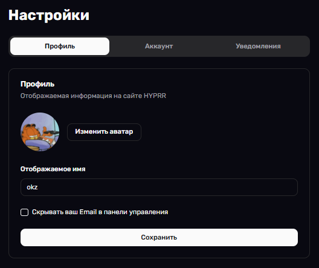
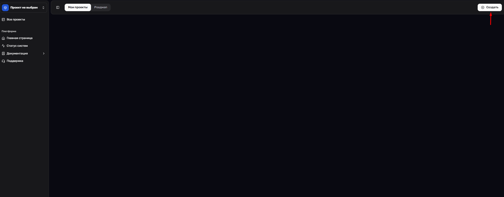
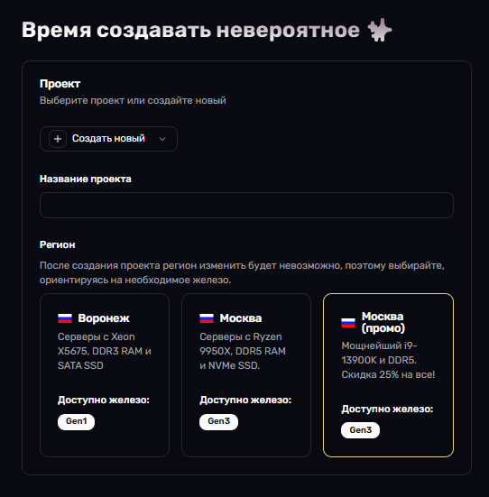
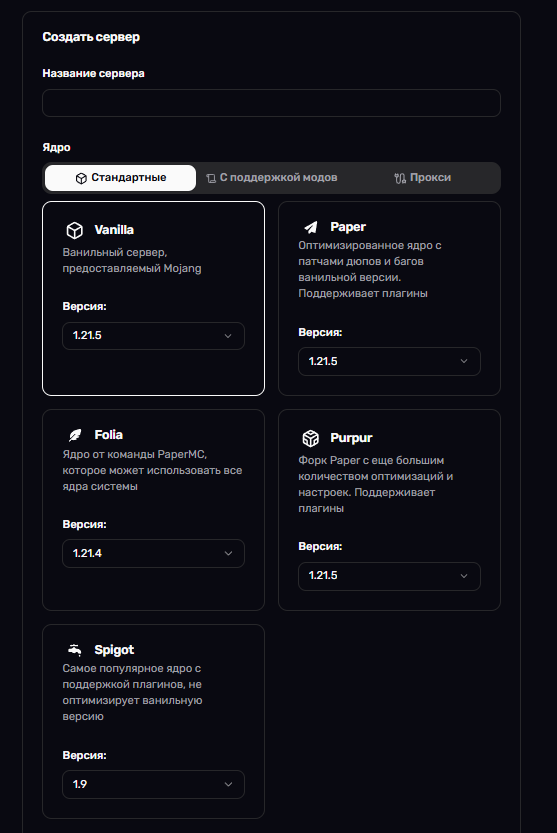
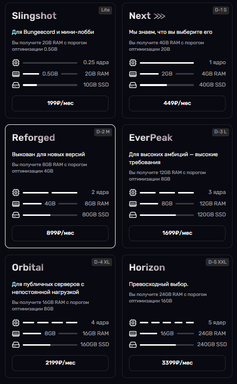
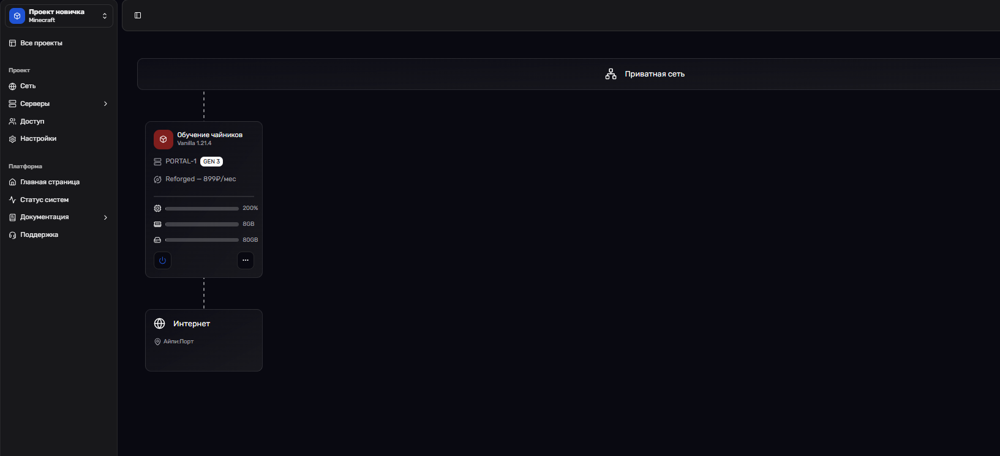

# Начало работы

Добро пожаловать в руководство по началу работы с HYPRR. Здесь вы найдете всю необходимую информацию для начала использования нашей платформы.

## Первые шаги

1. **Регистрация аккаунта**
 
 Перейдите на сайт [HYPRR](https://hyprr.space/auth) и создайте аккаунт — это займёт всего пару минут.

2. **Настройка профиля**

 В настройках профиля вы можете:
 - Изменить отображаемое имя
 - Скрыть свою электронную почту *(режим стримера)*
 - Изменить аватарку

 Если нужно:
 - В разделе **«Аккаунт»** можно сменить пароль
 - В разделе **«Уведомления»** можно включить или отключить уведомления на почту

 

3. **Создание первого проекта**

 Для создания своего первого проекта вам нужно перейти в [Панель управления](https://hyprr.space/dashboard) после регистрации аккаунта. Затем в разделе **«Мои проекты»** вы увидите белую кнопку **«Создать»** в правом верхнем углу. После нажатия на эту кнопку выберите проект **«Создать новый»**. Затем вы сможете выбрать название проекта и регион, в котором он будет находиться.

 
 *Первый шаг: нажатие на кнопку «Создать» в панели управления.*

 
 *Второй шаг: Выбран врянт «Создать новый» и настройка будущего проекта.*

4. **Создание сервера внутри вашего проекта**

 Отлично! Вы выбрали название проекта и регион — осталось совсем немного, и вы уже сможете запустить свой собственный сервер Minecraft.

 Теперь перейдём к следующему этапу — созданию сервера:
 1. **Введите название сервера** 

 Это имя будет отображаться в панели управления и поможет вам ориентироваться среди других ваших серверов.

 2. **Выберите ядро**

 На этом этапе вы указываете, как будет работать ваш сервер: с модами, плагинами или в чистом виде. В зависимости от выбранного типа, система автоматически подберёт подходящее серверное ядро и установит его. Это избавит вас от необходимости вручную разбираться с конфигурацией.

 

 3. **Выбор тарифа**
 
 Далее выберите тарифный план, который соответствует вашим потребностям: будь то игра в одиночку, с друзьями или хостинг большого количества игроков. У каждого тарифа указаны лимиты по оперативной памяти, слотам и другим параметрам — ориентируйтесь на свои задачи и бюджет.

 Все параметры и пояснения вы найдёте прямо на странице создания сервера — интерфейс интуитивно понятен и не требует технических знаний. Как только вы всё заполнили, нажмите кнопку **«Заказать»**, и через несколько минут он будет готов к использованию.

 
 *Важное замечание! Тарифы разделяются на «Динамические» и «Стандартные» пояснение можно найти на странице FAQ*

 4. **После заказа**

 Поздравляем! Ваш Minecraft-сервер успешно создан, и теперь вы можете приступить к его запуску и настройке.

 Базовое управление сервером — такие функции, как включение, выключение и перезагрузка, копирование айпи, сделать айпи сервера приватным — доступно прямо в панели управления проекта. Интерфейс интуитивно понятен и позволяет быстро выполнять основные действия.

 Если вам требуется более гибкое и расширенное управление сервером (например, доступ к консоли, настройкам ядра, файлам сервера и логам), нажмите на кнопку **«Серверы»** в главном меню. После этого откроется отдельная страница с полным набором инструментов для продвинутого администрирования.

